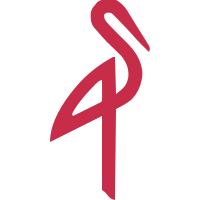
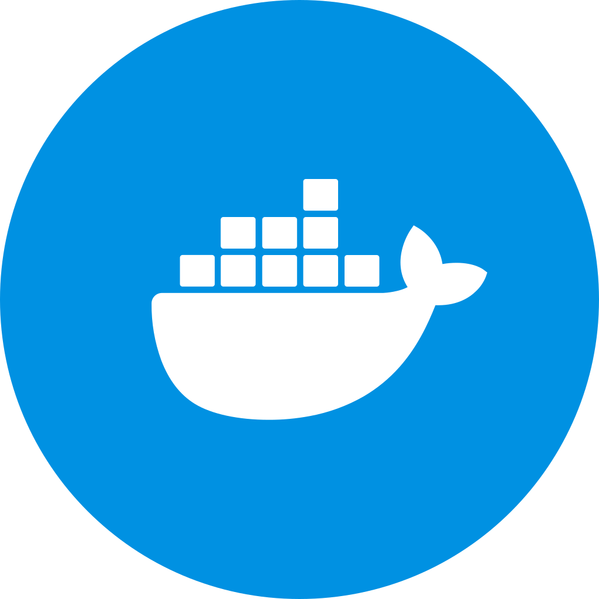
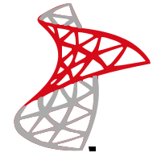
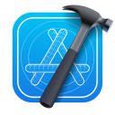
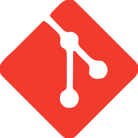

   
   
   <h1 align="center" style="color:#2563EB; font-weight:bold;">
      
   </h1>

   

   

      <h1>Social</h1>
   

   

      

         <b>Development Profiles</b>
      

       
      

         
         
         
      

       
      

         
         
         
      

   

   

      

         <b>Social Media Profiles</b>
      

       
      

         
         
         
         
      

       
      

         
         
         
      

   

   

      <h1>Experience</h1>
   

   

      <table>
         <tr>
            <tr>
               <td rowspan="5" align="center">
                  
               </td>
            </tr>
            <tr>
               <td colspan="2" align="left">
                  <b>Company: </b>
                  <a href="https://glomil.com/en-us/homepage" target="_blank" rel="noreferrer">
                     Glomil Technology
                  </a>
               </td>
               <th align="left">Start Date:</th>
            </tr>
            <tr>
               <td colspan="2" align="left">
                  <b>Title: </b>Computer Engineer
               </td>
               <td align="left">February 2023</td>
            </tr>
            <tr>
               <td colspan="2" align="left">
                  <b>Employment Type: </b>Full-Time
               </td>
               <th align="left">End Date:</th>
            </tr>
            <tr>
               <td colspan="2" align="left">
                  <b>Location Type: </b>Hybrid
               </td>
               <td align="left">March 2025</td>
            </tr>
         </tr>
         <tr><td colspan="4"></td></tr>
         <tr>
            <tr>
               <td rowspan="5" align="center">
                  
               </td>
            </tr>
            <tr>
               <td colspan="2" align="left">
                  <b>Company: </b>
                  <a href="https://www.acibadem.edu.tr/en/" target="_blank" rel="noreferrer">
                     Acibadem University
                  </a>
               </td>
               <th align="left">Start Date:</th>
            </tr>
            <tr>
               <td colspan="2" align="left">
                  <b>Title: </b>Intern
               </td>
               <td align="left">July 2021</td>
            </tr>
            <tr>
               <td colspan="2" align="left">
                  <b>Employment Type: </b>Internship
               </td>
               <th align="left">End Date:</th>
            </tr>
            <tr>
               <td colspan="2" align="left">
                  <b>Location Type: </b>On-site
               </td>
               <td align="left">August 2021</td>
            </tr>
         </tr>
         <tr><td colspan="4"></td></tr>
         <tr>
            <tr>
               <td rowspan="5" align="center">
                  
               </td>
            </tr>
            <tr>
               <td colspan="2" align="left">
                  <b>Company: </b>
                  <a href="https://www.ifs.com/" target="_blank" rel="noreferrer">
                     IFS Solutions
                  </a>
               </td>
               <th align="left">Start Date:</th>
            </tr>
            <tr>
               <td colspan="2" align="left">
                  <b>Title: </b>Software Developer
               </td>
               <td align="left">August 2018</td>
            </tr>
            <tr>
               <td colspan="2" align="left">
                  <b>Employment Type: </b>Full-Time
               </td>
               <th align="left">End Date:</th>
            </tr>
            <tr>
               <td colspan="2" align="left">
                  <b>Location Type: </b>On-site
               </td>
               <td align="left">January 2019</td>
            </tr>
         </tr>
         <tr><td colspan="4"></td></tr>
         <tr>
            <tr>
               <td rowspan="5" align="center">
                  
               </td>
            </tr>
            <tr>
               <td colspan="2" align="left">
                  <b>Company: </b>
                  <a href="https://www.bdh.com.tr/" target="_blank" rel="noreferrer">
                     BDH - IT SUPPORT SERVICES
                  </a>
               </td>
               <th align="left">Start Date:</th>
            </tr>
            <tr>
               <td colspan="2" align="left">
                  <b>Title: </b>Intern
               </td>
               <td align="left">July 2017</td>
            </tr>
            <tr>
               <td colspan="2" align="left">
                  <b>Employment Type: </b>Internship
               </td>
               <th align="left">End Date:</th>
            </tr>
            <tr>
               <td colspan="2" align="left">
                  <b>Location Type: </b>On-site
               </td>
               <td align="left">August 2017</td>
            </tr>
         </tr>
         <tr><td colspan="4"></td></tr>
         <tr>
            <tr>
               <td rowspan="5" align="center">
                  
               </td>
            </tr>
            <tr>
               <td colspan="2" align="left">
                  <b>Company: </b>
                  <a href="https://iett.istanbul/en" target="_blank" rel="noreferrer">
                     IETT - ISTANBUL ELECTRIC TRAMWAY AND TUNNEL OPERATIONS
                  </a>
               </td>
               <th align="left">Start Date:</th>
            </tr>
            <tr>
               <td colspan="2" align="left">
                  <b>Title: </b>Intern
               </td>
               <td align="left">September 2015</td>
            </tr>
            <tr>
               <td colspan="2" align="left">
                  <b>Employment Type: </b>Internship
               </td>
               <th align="left">End Date:</th>
            </tr>
            <tr>
               <td colspan="2" align="left">
                  <b>Location Type: </b>On-site
               </td>
               <td align="left">June 2016</td>
            </tr>
         </tr>
      </table>
   

   

      <h1>Education</h1>
   

   

      <table>
         <tr>
            <tr>
               <td rowspan="6" align="center">
                  
               </td>
            </tr>
            <tr>
               <td colspan="3" align="left">
                  <a href="https://uskudar.edu.tr/en" target="_blank" rel="noreferrer">
                     Uskudar University
                  </a>
               </td>
            </tr>
            <tr>
               <td colspan="2" align="left"><b>Faculty: </b>Bachelor’s Degree, Faculty of Engineering and Natural Sciences</td>
               <th align="left">Start Date:</th>
            </tr>
            <tr>
               <td colspan="2" align="left"><b>Department: </b>Computer Engineering (English)</td>
               <td align="left">September 2019</td>
            </tr>
            <tr>
               <td colspan="2" align="left"><b>Grade Point Average (GPA): </b>3.48</td>
               <th align="left">End Date:</th>
            </tr>
            <tr>
               <td colspan="2" align="left">
                  

                     <b>Activities and Societies: </b>Tech Club 
                     <b>Graduation Project & Thesis: </b>Web Crawler and Indexer
                  

               </td>
               <td align="left">October 2022</td>
            </tr>
         </tr>
         <tr><td colspan="4"></td></tr>
         <tr>
            <tr>
               <td rowspan="6" align="center">
                  
               </td>
            </tr>
            <tr>
               <td colspan="3" align="left">
                  <a href="https://ayvansaray.edu.tr/en-US" target="_blank" rel="noreferrer">
                     Istanbul Ayvansaray University
                  </a>
               </td>
            </tr>
            <tr>
               <td colspan="2" align="left"><b>Faculty: </b>Associate's Degree, Plato Vocational School</td>
               <th align="left">Start Date:</th>
            </tr>
            <tr>
               <td colspan="2" align="left"><b>Department: </b>Computer Programming</td>
               <td align="left">August 2016</td>
            </tr>
            <tr>
               <td colspan="2" align="left"><b>Grade Point Average (GPA): </b>3.55</td>
               <th align="left">End Date:</th>
            </tr>
            <tr>
               <td colspan="2" align="left">
                  

                     <b>Graduation Project & Thesis: </b>Smart Drone with Image Processing
                  

               </td>
               <td align="left">June 2018</td>
            </tr>
         </tr>
      </table>
   

   

      <h1>Skills</h1>
   

   

      

         <b>Programming Languages</b>
      

       
      
      
      
      
   

   

      

         <b>Frameworks & Libraries</b>
      

       
      
      
      
      
      
      
       
      
      
      
      
      
      
   

   

      

         <b>Containerization</b>
      

       
      
      
      
   

   

      

         <b>Database</b>
      

       
      
      
      
      
      
   

   

      

         <b>Client-Side Scripting</b>
      

       
      
      
      
      
   

   

      

         <b>Editors</b>
      

      
      
      
   

   

      

         <b>Git</b>
      

      
      
      
      
   

   

      

         <b>Tools</b>
      

      
   

   

      <h1>GitHub</h1>
   

   

      

         <b>Contributions & Streaks</b>
      

       
      
   

   

      

         <b>Contribution Graph</b>
      

       
      
   

   

      

         <b>Statistics</b>
      

       
      
   

   

      

         <b>Most Used Languages</b>
      

       
      
   

   

      

         <b>Trophies</b>
      

       
      
   

   

      <h1>Donation</h1>
   

   

      

         <b>Buy Me a Coffee</b>
      

       
      
   

   

      

         <b>Bitcoin</b>
      

       
      
       
      
       
      
       
      
   

   

      

         <b>Ethereum</b>
      

       
      
   

   

      

         <b>Avalanche</b>
      

       
      
       
      
   

   

      

         <b>Cardano</b>
      

       
      
   

   

      

         <b>Ripple</b>
      

       
      
   

